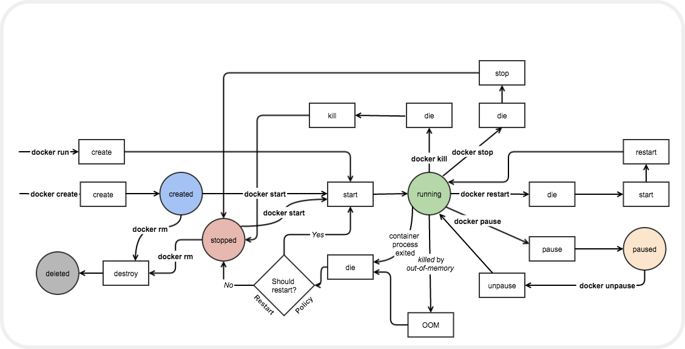

## 一、Why?

🐳`Docker` 基于` C/S` 对外提供了 `Restful API`。前端对 `Docker` 还是有一定的需求量的，后端就更不用说了，使用 `Docker` 可以轻松的构建与服务器一致的开发环境环境，但同时也增加了学习成本与维护难度。

## 二、Docker 基础知识

### 2.1 Docker 架构


> 🐳`Docker` 使用了经典的 ：`C/S` 架构。

### 2.2 docker 基本概念

| 概念 | 描述 |
| --- | --- |
| `Image`镜像 | 只读模板，包含应用程序所需的文件系统、库和配置。 |
| `Container`容器 | 基于镜像创建的可执行实例，在隔离环境中运行应用程序。 |
| `Dockerfile` | 包含构建镜像所需的指令的文本文件。 |
| `Docker` 客户端 | 用户与 `Docker` 系统交互的界面，可以是 `CLI` 或 `GUI`。 |
| `Docker` 服务器 | 后台守护进程，管理容器、镜像、网络等。 |
| `Docker` 注册表 | 存储和共享 `Docker` 镜像的地方，如 `Docker Hub`。 |
| `Docker Compose` | 定义和管理多个服务、网络、卷的工具，简化应用程序部署。 |
| `Docker` 网络和卷 | 允许容器间通信的网络，以及用于持久化存储的卷。 |
| `Docker Swarm` | 用于容器编排和集群管理的工具，实现高可用性和负载均衡。 |
| `Kubernetes` | 强大的容器编排平台，用于自动化容器化应用程序的部署和管理。 |

> 容器和镜像是 Docker 的主要内容，只给出基础概念。

### 2.3 `Docker` 镜像状态


| 镜像状态                | 描述                                     |
| ----------------------- | ---------------------------------------- |
| `Available`（可用）     | 镜像已被构建，位于本地或远程镜像仓库中。 |
| `Downloading`（下载中） | 正在从远程镜像仓库下载镜像。             |
| `Downloaded`（已下载）  | 镜像已成功下载到本地。                   |
| `Creating`（创建中）    | 正在基于 `Dockerfile` 构建新的镜像。     |
| `Building`（构建中）    | 镜像正在构建，可能包括多个构建阶段。     |
| `Uploading`（上传中）   | 正在将本地构建的镜像上传到远程镜像仓库。 |
| `Pushing`（推送中）     | 正在将本地镜像推送到远程镜像仓库。       |
| `Error`（错误）         | 在构建、下载或上传过程中遇到了错误。     |

### 2.4 docker 容器状态



| 容器状态     | 描述                             |
| ------------ | -------------------------------- |
| `Created`    | 已创建，尚未启动                 |
| `Running`    | 运行中，应用程序正在执行         |
| `Paused`     | 已暂停，应用程序被冻结           |
| `Restarting` | 正在重启，容器正在重新启动       |
| `Exited`     | 已退出，应用程序已执行完毕或终止 |
| `Dead`       | 已终止，应用程序无法启动或崩溃   |
| `Removing`   | 正在移除，容器正在被删除         |

## 三、Docker Desktop 问题


- 🪢没有实现国际化语言支持
- 🎃不同的设备存在自动退出情况
- 🥎客户端展示的数据不够编程化
- 🥏不同的设备可能存在启动慢
- ...

## 四、社区容器管理


目前市面上已有的 Docker 第三方工具：

- 🌿[**Kubernetes**](https://kubernetes.io/zh-cn/) 开源的容器编排和管理工具，用于自动化部署、扩展和操作应用程序容器。它是一个高度可定制的平台，适用于大规模容器化部署。
- 🍃[**Swarm**](https://docs.docker.com/engine/swarm/): `Docker Swarm` 是 `Docker` 官方提供的原生容器编排工具，用于将多个Docker容器组织成一个集群，并实现容器的自动扩展和管理。
- 🍂[**Portainer**](https://www.portainer.io/): `Portainer` 是一个简单易用的 `Docker` 管理界面，它可以帮助您可视化地管理和监控 `Docker` 容器、镜像、卷等资源。
- 🍀[**traefik**](https://doc.traefik.io/traefik/)： 发现使用 `Traefik Labs` 的一体化 `API` 管理、`API` 网关和入口解决方案，以最快、最简便的方式发布、保护和管理规模化的 `API` 和微服务。

## 五、开始之前

`Restful API` 需要打开本地监听的 `2375` 端口：

```sh
"hosts": [
    "tcp://0.0.0.0:2375"
  ]
```

`curl` 检测是否能够访问 `Docker` 体统的 `Restful` 服务：

```sh
curl GET http://localhost:2375/version # 默认版本
curl GET http://localhost:2375/v1.43/version # 指定版本
```


> 如果还没有成功:
>
> - 🎏检测防火墙
> - 🎍重启

- 安全提示

> `Docker` 提供的 `Restful` 服务使用时一定考虑安全问题，尤其是生成环境，考虑是否使用能够 `Docker`.

## 六、Docker Restful API


> Engine API 是由 Docker Engine 提供服务的 HTTP API。它是 Docker 客户端用来与 Engine 通信的 API，因此 Docker 客户端能做的一切都可以通过该 API 完成。
>
> 当前版本v1.43：[Docker Restful API](https://docs.docker.com/engine/api/v1.43)

### 6.1 API 解读

- 版本

```
# 示例 `api` 是` v1.30` 版本
/v1.30/info
```

- 统一错误处理

```ts
{
  "message": "page not found"
}
```

> 默认情况下不需要使用指定版本

- 核心 `api`

| api | 说明 |
| --- | --- |
| 授权认证 | [Authentication](https://docs.docker.com/engine/api/v1.43/#section/Authentication) |
| 容器 | [Container](https://docs.docker.com/engine/api/v1.43/#tag/Container) 容器相关的 API（列表、详情、启动、删除、停止...） |
| 镜像 | [Image](https://docs.docker.com/engine/api/v1.43/#tag/Image) 镜像相关的 API（列表、详情、创建容器...） |
| 网络 | [Network](https://docs.docker.com/engine/api/v1.43/#tag/Network) 网络创建、删除等 |
| 卷 | [Volume](https://docs.docker.com/engine/api/v1.43/#tag/Volume) 卷相关操作 |
| 其他 | ... |

- 查询参数：过滤器 filters

filters 被设计成为一个json 数据结构，传递参数需要使用json 数据结构, 以下是 filters 实现示例

```js
const data = await queryVolumesList({
  name: args[0].ImageID,
  filters: JSON.stringify({ name: [args[0].ImageID] }),
});
```

## 七、选择 Umi.js


- 基于 `React` 框架,丰富的社区资源
- 简单的路由配置和模型数据支持
- 内置 `antd/pro-components/icons` 组件的支持，快速实现原型
- ...

## 八、项目


### 入口

> ❤️❤️❤️ 开源项目： [iDocker](https://github.com/yyong008/iDocker) 欢迎提出宝贵意见。

### 简要说明

| 首页       | 说明                       |
| ---------- | -------------------------- |
| 首页       | docker 基础信息            |
| 镜像列表   | 展示当前设备中的所有镜像   |
| 镜像详情页 | 镜像详情内容               |
| 镜像搜索页 | 在 Docker Hub 搜索镜像     |
| 容器列表   | 当前设备的容器列表         |
| 容器详情页 | 容器详情                   |
| 卷列表页   | 当前设备中 docker 的卷列表 |
| 卷详情页   | 当前卷的详情               |
| 系统管理页 | docker系统相关页           |

### 未来展望

- 功能优化
- `Docker` 集群功能支持

## 九、小结

本主要讲解了 `Docker` 的基础内容（以概念为主）侧重于容器的状态、镜像的各种状态层面的作为说明，其次讲解 `Docker` 的 `Restful API` 简单使用方法。由此基于 `Umi.js` 扩展出了基本的 `Web` 项目。本文对 `Docker` 应用层面有一些探索。你的点赞、收藏对 作者非常重要，希望这篇文章能够帮助到你，感谢！
